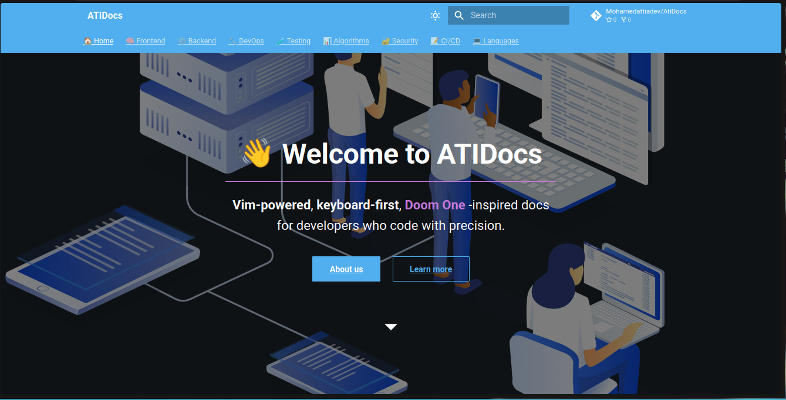

# 📘 ATIDocs

ATIDocs is a beautifully customized developer documentation site built using **MkDocs Material** with a **Doom One**–inspired theme. It supports frontend, backend, DevOps, testing, algorithms, security, CI/CD, and programming languages with a colorful, intuitive, and responsive UI.



---

## 🚀 Features

- 🎨 Fully themed with **Doom One** colors (dark + light mode)
- 📱 Responsive design for mobile, tablet, and desktop
- 🔍 Full-text **search with highlighting**, suggestions & sharing
- 🧠 Organized into smartly grouped sections: Frontend, Backend, DevOps, etc.
- 🧩 Annotated and copy-enabled **code blocks**
- 🛠️ Support for math, footnotes, tabs, emoji, keyboard hints, and more
- 📂 Clean structure with override support for header, tabs, and layout
- 🌐 Easy deploy to GitHub Pages

---

## 📦 Getting Started

### 1. Clone the Repository

```bash
git clone https://github.com/Mohamedattiadev/AtiDocs.git
cd AtiDocs
```

### 2. Create a Virtual Environment (recommended)

```bash
python3 -m venv venv
source venv/bin/activate
```

### 3. Install Requirements

```bash

pip install mkdocs mkdocs-material mkdocs-material-extensions pymdown-extensions

pip install -r requirements.txt
```

### 4. Run Locally

```bash
mkdocs serve
```

Visit: http://localhost:8000

---

## ⚙️ Configuration Overview

- All settings live in `mkdocs.yml` (theme, nav, plugins, features, palette)
- All extra CSS styles live in `overrides/assets/stylesheets/extra.css`
- Header override: `overrides/partials/header.html` **or any part of the site**

---

## 🌐 Deployment

First time deploying? Run:

```bash
mkdocs gh-deploy
```

Make sure to customize the repo URL in `.github/workflows/deploy.yml` if you're using GitHub Actions.

---

## 📁 Docs Structure

```bash
AtiDocs/
├── docs/
│   ├── assets/  # the images
│   │     ├── stylesheets/extra.css
│   │     └── images/screenshot.png
│   │
│   ├── index.md # the home page
│   ├── frontend/
│   ├── backend/
│   ├── devops/
│   └── ...
│
├── overrides/
│   └── partials/..name.. .html # override any part u want ((check the mkdocs-material docs))
├── mkdocs.yml # the main config
└── README.md  # the readme file

```

---

## 🧠 Topics Covered

- 🧠 Frontend (JS, TS, React, Vue, Next, etc.)
- ⚙️ Backend (Node, Express, APIs)
- 🔧 DevOps (Docker, Nginx)
- 🧪 Testing (Jest, Vitest)
- 📊 Algorithms (Sorting, Graphs)
- 🔐 Security (JWT, CSRF)
- 📝 CI/CD (Git, Shell, VS Code, Neovim)
- 💻 Languages (Python, Java, C/C++, Lua, etc.)

---

## 🙋‍♂️ Author

**Mohamed Attia**

- 📸 [Instagram](https://www.instagram.com/mohmd_attia/)
- 💻 [GitHub](https://github.com/Mohamedattiadev)
- 🐦 [Twitter / X](https://x.com/Mohmd_Attia)
- 💼 [LinkedIn](https://www.linkedin.com/in/mohmd-attia/)

---

## 📜 License

MIT © 2025 Mohamed Attia
