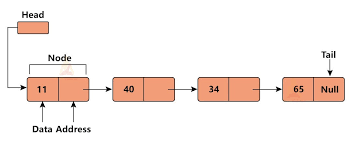
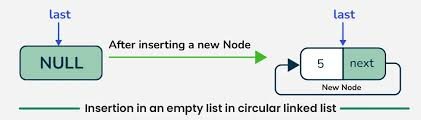

# Linked List - Visual & Code Guide

<div style="display: grid; grid-template-columns: repeat(auto-fit, minmax(250px, 1fr)); gap: 1rem;">
  
</div>

---

## 1. Linked List Creation

### 1.1 Structure of a Node

- A linked list is made of nodes.
- Each node stores:
  - A value (`data`)
  - A pointer to the next node (`next`)

### 1.2 Creating Individual Nodes

- Nodes are created with values: **5**, **10**, **15**, **20**
- Each new node points to the next node.

➡️ <span style="color:#51afef">5</span> → <span style="color:#51afef">10</span> → <span style="color:#51afef">15</span> → <span style="color:#51afef">20</span> → NULL

### 1.3 Linking Nodes

- Connect all nodes one after another.
- The final node points to `NULL`, which marks the end of the list.

### 1.4 Final Structure

> <span style="color:#51afef">5</span> → <span style="color:#51afef">10</span> → <span style="color:#51afef">15</span> → <span style="color:#51afef">20</span> → NULL ✅ Created Successfully

---

## 2. Insertion in an Empty Linked List

<div style="display: grid; grid-template-columns: repeat(auto-fit, minmax(200px, 1fr)); gap: 1rem;">
  
</div>

- Start with `head = nullptr`
- Create a single node with value **10**
- Make `head` point to this new node

---

## 3. Linked List Insertion (General)

### 3.1 Initial Linked List

Start with: `10 → 20 → 30 → NULL`  
➡️ <span style="color:#51afef">10</span> → <span style="color:#51afef">20</span> → <span style="color:#51afef">30</span> → NULL

---

### 3.2 Insert at the Beginning

#### Method 1: Pass by Value (Incorrect)

- A new node <span style="color:#51afef">5</span> is created.
- It points to the old head.
- But since the original head is passed **by value**, the change does not persist.

➡️ No change in the list

#### Method 2: Pass by Reference (Correct ✅)

- A new node <span style="color:#51afef">5</span> is created.
- It points to the old head.
- The actual `head` is updated to this new node.

➡️ <span style="color:#51afef">5</span> → 10 → 20 → 30 → NULL

---

### 3.3 Insert at the End

- Traverse the list to the last node.
- Create a new node <span style="color:#51afef">40</span>.
- Link it to the last node.

➡️ 5 → 10 → 20 → 30 → <span style="color:#51afef">40</span> → NULL

---

### 3.4 Insert in the Middle (After a Specific Node)

- Traverse to the node <span style="color:#51afef">20</span>.
- Create a new node <span style="color:#51afef">25</span>.
- Insert it right after 20 by adjusting pointers.

➡️ 5 → 10 → 20 → <span style="color:#51afef">25</span> → 30 → 40 → NULL

---

### 3.5 Final Linked List After Insertion

> <span style="color:#51afef">5</span> → <span style="color:#51afef">10</span> → <span style="color:#51afef">20</span> → <span style="color:#51afef">25</span> → <span style="color:#51afef">30</span> → <span style="color:#51afef">40</span> → NULL ✅ Updated Successfully

---

## 4. Linked List Deletion

### 4.1 Initial Linked List

Create a list with: `10 → 0 → 100 → 200 → 300 → 400 → NULL`  
➡️ <span style="color:#51afef">10</span> → <span style="color:#51afef">0</span> → <span style="color:#51afef">100</span> → <span style="color:#51afef">200</span> → <span style="color:#51afef">300</span> → <span style="color:#51afef">400</span> → NULL

---

### 4.2 Delete First Node

- Remove the `head` node (**10**).
- Update `head` to point to the next node (**0**).

➡️ <span style="color:#51afef">0</span> → 100 → 200 → 300 → 400 → NULL

---

### 4.3 Delete Last Node

- Traverse to the second-last node (**300**).
- Remove the last node (**400**).
- Set `300 → NULL`.

➡️ 0 → 100 → 200 → <span style="color:#51afef">300</span> → NULL

---

### 4.4 Delete a Specific Node (e.g. 200)

- Traverse the list to the node just before **200**.
- Skip over **200** by adjusting the `next` pointer.

➡️ 0 → 100 → <span style="color:#51afef">300</span> → NULL

---

### 4.5 Delete Non-Existent Node (e.g. 2200)

- Traverse the list.
- If value not found, print: `"Value 2200 not found in the list."`

➡️ List remains unchanged

---

### 4.6 Final Linked List After Deletion

> <span style="color:#51afef">0</span> → <span style="color:#51afef">100</span> → <span style="color:#51afef">300</span> → NULL ✅ Updated Successfully

---

## 5. Searching in Linked List

### 5.1 Iterative Search

- Loop through each node.
- Compare `data` with the target.
- If match is found, return `true`.
- Else, reach end and return `false`.

### 5.2 Recursive Search

- Base case: return `false` if `head == NULL`
- If data matches, return `true`
- Otherwise, recursively call with `head->next`

---

## 6. Full C++ Code (All Operations)

```cpp
#include <iostream>
using namespace std;

struct Node {
    int data;
    Node *next;

    Node(int value) {
        data = value;
        next = nullptr;
    }
};

void print(Node *head) {
    Node *temp = head;
    while (temp) {
        cout << temp->data << " --> ";
        temp = temp->next;
    }
    cout << "NULL" << endl;
}

void insertAtBeginning(Node *&head, int value) {
    Node *newNode = new Node(value);
    newNode->next = head;
    head = newNode;
}

void insertAtEnd(Node *&head, int value) {
    Node *newNode = new Node(value);
    if (!head) {
        head = newNode;
        return;
    }
    Node *temp = head;
    while (temp->next)
        temp = temp->next;
    temp->next = newNode;
}

void insertAfter(Node *prevNode, int value) {
    if (!prevNode) return;
    Node *newNode = new Node(value);
    newNode->next = prevNode->next;
    prevNode->next = newNode;
}

void deleteSpecific(Node *&head, int value) {
    if (!head) return;

    if (head->data == value) {
        Node *toDelete = head;
        head = head->next;
        delete toDelete;
        return;
    }

    Node *temp = head;
    while (temp->next && temp->next->data != value)
        temp = temp->next;

    if (!temp->next) {
        cout << "Value " << value << " not found in the list." << endl;
        return;
    }

    Node *toDelete = temp->next;
    temp->next = toDelete->next;
    delete toDelete;
}

void deleteLast(Node *&head) {
    if (!head) return;
    if (!head->next) {
        delete head;
        head = nullptr;
        return;
    }

    Node *second_last = head;
    while (second_last->next->next)
        second_last = second_last->next;

    delete second_last->next;
    second_last->next = nullptr;
}

Node* append(Node *&head, int value) {
    Node *newNode = new Node(value);
    if (!head) return newNode;

    Node *temp = head;
    while (temp->next)
        temp = temp->next;
    temp->next = newNode;
    return head;
}

bool searchIterative(Node *head, int key) {
    Node *temp = head;
    while (temp) {
        if (temp->data == key)
            return true;
        temp = temp->next;
    }
    return false;
}

bool searchRecursive(Node *head, int key) {
    if (!head) return false;
    if (head->data == key) return true;
    return searchRecursive(head->next, key);
}

int main() {
    Node *head = new Node(10);
    Node *second = new Node(20);
    Node *third = new Node(30);
    head->next = second;
    second->next = third;

    cout << "Original Linked List: ";
    print(head);

    insertAtBeginning(head, 5);
    cout << "After Insertion at Beginning: ";
    print(head);

    insertAtEnd(head, 40);
    cout << "After Insertion at End: ";
    print(head);

    insertAfter(second, 25);
    cout << "After Insertion in Middle (After 20): ";
    print(head);

    deleteSpecific(head, 5);
    cout << "After Deleting 5: ";
    print(head);

    deleteLast(head);
    cout << "After Deleting Last Node: ";
    print(head);

    deleteSpecific(head, 25);
    cout << "After Deleting 25: ";
    print(head);

    cout << "Search 30 (Iterative): " << (searchIterative(head, 30) ? "Found" : "Not Found") << endl;
    cout << "Search 100 (Recursive): " << (searchRecursive(head, 100) ? "Found" : "Not Found") << endl;

    return 0;
}
```

## Video:

<div style="display: grid; grid-template-columns: repeat(auto-fit, minmax(250px, 1fr)); gap: 1rem;">

  <a href="https://www.youtube.com/watch?v=cg6JGiXhQ9c&list=PLgUwDviBIf0rAuz8tVcM0AymmhTRsfaLU" target="_blank" style="text-align: center; display: block; padding: 1em; border-radius: 10px; text-decoration: none;">
    
    <strong style="display: block; margin-top: 0.5em;">Sorting - algorithm </strong>
  </a>

</div>
