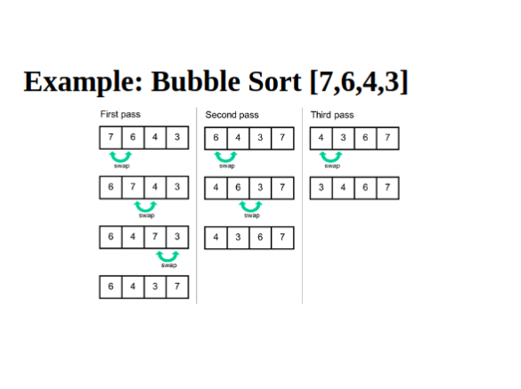

# Bubble Sort

<div style="display: grid; grid-template-columns: repeat(auto-fit, minmax(250px, 1fr)); gap: 1rem;">
  
</div>

---

### **Initial Array:**

`[20, 12, 10, 15, 2]`

---

### **Pass 1:**

- Compare adjacent elements and swap if needed.
- Largest element moves to the end.

➡️ <code><span style="color:#51afef;">12</span>, <span style="color:#51afef;">20</span>, 10, 15, 2</code>  
➡️ <code>12, <span style="color:#51afef;">10</span>, <span style="color:#51afef;">20</span>, 15, 2</code>  
➡️ <code>12, 10, <span style="color:#51afef;">15</span>, <span style="color:#51afef;">20</span>, 2</code>  
➡️ <code>12, 10, 15, <span style="color:#51afef;">2</span>, <span style="color:#51afef;">20</span></code>

---

### **Pass 2:**

- The largest element `20` is sorted.
- Repeat for the rest.

➡️ <code><span style="color:#51afef;">10</span>, <span style="color:#51afef;">12</span>, 15, 2, 20</code>  
➡️ No swap (12 < 15)  
➡️ <code>10, 12, <span style="color:#51afef;">2</span>, <span style="color:#51afef;">15</span>, 20</code>

---

### **Pass 3:**

- Elements `15` and `20` are now sorted.
- Keep sorting the front.

➡️ No swap (10 < 12)  
➡️ <code><span style="color:#51afef;">10</span>, <span style="color:#51afef;">2</span>, 12, 15, 20</code>

---

### **Pass 4:**

- Final pass to place smallest two correctly.

➡️ <code><span style="color:#51afef;">2</span>, <span style="color:#51afef;">10</span>, 12, 15, 20</code>

---

### **Final Sorted Array:**

<code><span style="color:#51afef;">2</span>, <span style="color:#51afef;">10</span>, <span style="color:#51afef;">12</span>, <span style="color:#51afef;">15</span>, <span style="color:#51afef;">20</span></code>

---

## Bubble Sort - C++ Implementation

```cpp
#include <iostream>
using namespace std;

void bubbleSort(int arr[], int n)
{
    for (int i = 0; i < n - 1; i++)
    {
        for (int j = 0; j < n - i - 1; j++)
        {
            if (arr[j] > arr[j + 1])
            {
                swap(arr[j], arr[j + 1]);
            }
        }
    }
}

void printArray(int arr[], int n)
{
    for (int i = 0; i < n; i++)
        cout << arr[i] << " ";
    cout << endl;
}

int main()
{
    int arr[] = {65, 25, 12, 22, 11};
    int n = sizeof(arr) / sizeof(arr[0]);

    cout << "Original array: ";
    printArray(arr, n);

    bubbleSort(arr, n);

    cout << "Sorted array: ";
    printArray(arr, n);

    return 0;
}
```
