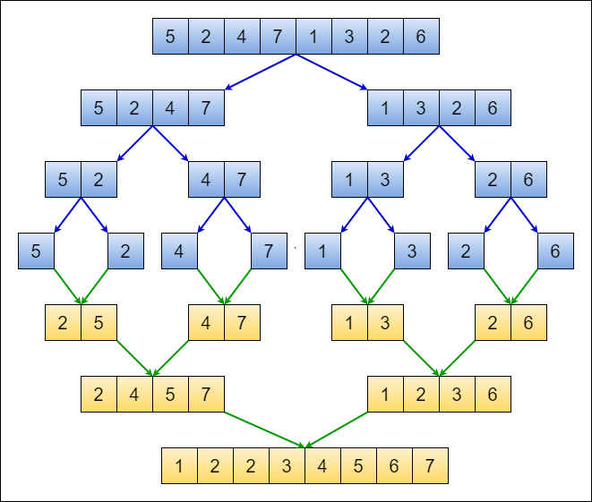
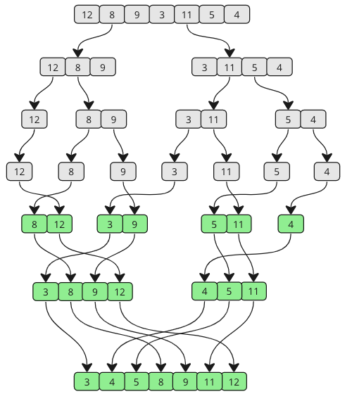

# Merge Sort

<div style="display: grid; grid-template-columns: repeat(auto-fit, minmax(250px, 1fr)); gap: 1rem;">
  
  
</div>

---

### **Initial Array:**

`[38, 27, 43, 3, 9, 82, 10]`

---

### **Step 1: Divide the Array**

| Left Subarray  | Right Subarray   |
| -------------- | ---------------- |
| `[38, 27, 43]` | `[3, 9, 82, 10]` |

➡️ Continue dividing:

`[38] , [27] , [43] , [3] , [9] , [82] , [10]`

---

### **Step 2: Merge & Sort Step-by-Step**

- Merge `[38]` and `[27]` → <span style="color:#7dcfff;">27</span>, <span style="color:#7dcfff;">38</span>
- Merge with `[43]` → <span style="color:#7dcfff;">27</span>, <span style="color:#7dcfff;">38</span>, <span style="color:#7dcfff;">43</span>
- Merge `[3]` and `[9]` → <span style="color:#7dcfff;">3</span>, <span style="color:#7dcfff;">9</span>
- Merge with `[82]` → <span style="color:#7dcfff;">3</span>, <span style="color:#7dcfff;">9</span>, <span style="color:#7dcfff;">82</span>
- Merge with `[10]` → <span style="color:#7dcfff;">3</span>, <span style="color:#7dcfff;">9</span>, <span style="color:#7dcfff;">10</span>, <span style="color:#7dcfff;">82</span>

➡️ Now two sorted halves:  
<span style="color:#7dcfff;">27</span>, <span style="color:#7dcfff;">38</span>, <span style="color:#7dcfff;">43</span>  
<span style="color:#7dcfff;">3</span>, <span style="color:#7dcfff;">9</span>, <span style="color:#7dcfff;">10</span>, <span style="color:#7dcfff;">82</span>

---

### **Step 3: Final Merge**

➡️ Compare & merge:

<span style="color:#7dcfff;">3</span>, <span style="color:#7dcfff;">9</span>, <span style="color:#7dcfff;">10</span>, <span style="color:#7dcfff;">27</span>, <span style="color:#7dcfff;">38</span>, <span style="color:#7dcfff;">43</span>, <span style="color:#7dcfff;">82</span>

---

### **Final Sorted Array:**

<code><span style="color:#7dcfff;">3</span>, <span style="color:#7dcfff;">9</span>, <span style="color:#7dcfff;">10</span>, <span style="color:#7dcfff;">27</span>, <span style="color:#7dcfff;">38</span>, <span style="color:#7dcfff;">43</span>, <span style="color:#7dcfff;">82</span></code>

> **Merge Sort completed successfully!**

---

## Merge Sort - C++ Implementation

```cpp
#include <iostream>
using namespace std;

void merge(int arr[], int low, int mid, int high) {
    int temp[high - low + 1]; // Temporary array
    int left = low;      // Starting index of left half of arr
    int right = mid + 1; // Starting index of right half of arr
    int k = 0;           // Index for temp array

    // Storing elements in the temporary array in a sorted manner
    while (left <= mid && right <= high) {
        if (arr[left] <= arr[right]) {
            temp[k] = arr[left];
            left++;
        } else {
            temp[k] = arr[right];
            right++;
        }
        k++;
    }

    // If elements on the left half are still left
    while (left <= mid) {
        temp[k] = arr[left];
        left++;
        k++;
    }

    // If elements on the right half are still left
    while (right <= high) {
        temp[k] = arr[right];
        right++;
        k++;
    }

    // Transferring all elements from temporary to arr
    for (int i = low; i <= high; i++) {
        arr[i] = temp[i - low];
    }
}

void mergeSort(int arr[], int low, int high) {
    if (low >= high) return;
    int mid = (low + high) / 2;
    mergeSort(arr, low, mid);     // Left half
    mergeSort(arr, mid + 1, high); // Right half
    merge(arr, low, mid, high);    // Merging sorted halves
}

int main() {
    int arr[] = {38, 27, 43, 3, 9, 82, 10};
    int n = sizeof(arr) / sizeof(arr[0]);

    cout << "Before Sorting Array: " << endl;
    for (int i = 0; i < n; i++) {
        cout << arr[i] << " ";
    }
    cout << endl;

    mergeSort(arr, 0, n - 1);

    cout << "After Sorting Array: " << endl;
    for (int i = 0; i < n; i++) {
        cout << arr[i] << " ";
    }
    cout << endl;

    return 0;
}
```
