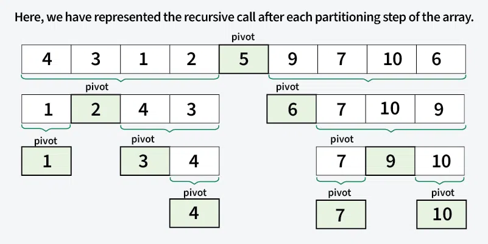
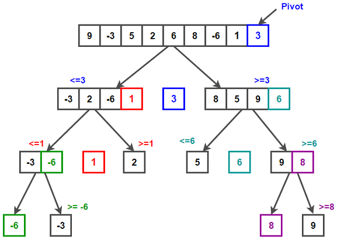

# Quick Sort

<div style="display: grid; grid-template-columns: repeat(auto-fit, minmax(250px, 1fr)); gap: 1rem;">
  
  
</div>

---

### **Initial Array:**

`[50, 23, 9, 18, 61, 32]`

---

### **Step 1: Choose a Pivot & Partition**

- **Pivot** = last element → **32**
- Rearrange such that:
  - Elements **less than** pivot go to **left**
  - Elements **greater** than pivot go to **right**

| Before Partition | 50  | 23  | 9   | 18     | 61  | **32** |
| ---------------- | --- | --- | --- | ------ | --- | ------ |
| After Partition  | 23  | 9   | 18  | **32** | 61  | 50     |

➡️ **Pivot 32 is now correctly placed.**

---

### **Step 2: Quick Sort Left Subarray** `[23, 9, 18]`

- **Pivot** = **18**

| Before Partition | 23  | 9      | **18** |
| ---------------- | --- | ------ | ------ |
| After Partition  | 9   | **18** | 23     |

➡️ **Pivot 18** placed at its correct position.

---

### **Step 3: Quick Sort Right Subarray** `[61, 50]`

- **Pivot** = **50**

| Before Partition | 61     | **50** |
| ---------------- | ------ | ------ |
| After Partition  | **50** | 61     |

➡️ **Pivot 50** placed correctly.

---

### **Final Sorted Array:**

<code><span style="color:#7dcfff;">9</span>, <span style="color:#7dcfff;">18</span>, <span style="color:#7dcfff;">23</span>, <span style="color:#7dcfff;">32</span>, <span style="color:#7dcfff;">50</span>, <span style="color:#7dcfff;">61</span></code>

> **Quick Sort completed successfully!**

---

## C++ Implementation - Quick Sort

```cpp
#include <iostream>
using namespace std;

int partition(int arr[], int low, int high) {
    int pivot = arr[low];
    int i = low;
    int j = high;

    while (i < j) {
        while (arr[i] <= pivot && i <= high - 1) {
            i++;
        }

        while (arr[j] > pivot && j >= low + 1) {
            j--;
        }

        if (i < j) swap(arr[i], arr[j]);
    }
    swap(arr[low], arr[j]);
    return j;
}

void qs(int arr[], int low, int high) {
    if (low < high) {
        int pIndex = partition(arr, low, high);
        qs(arr, low, pIndex - 1);
        qs(arr, pIndex + 1, high);
    }
}

void quickSort(int arr[], int n) {
    qs(arr, 0, n - 1);
}

int main() {
    int arr[] = {50, 23, 9, 18, 61, 32};
    int n = sizeof(arr) / sizeof(arr[0]);

    cout << "Before Using QuickSort: " << endl;
    for (int i = 0; i < n; i++) {
        cout << arr[i] << " ";
    }
    cout << endl;

    quickSort(arr, n);

    cout << "After Using QuickSort: " << endl;
    for (int i = 0; i < n; i++) {
        cout << arr[i] << " ";
    }
    cout << endl;

    return 0;
}
```
