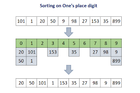
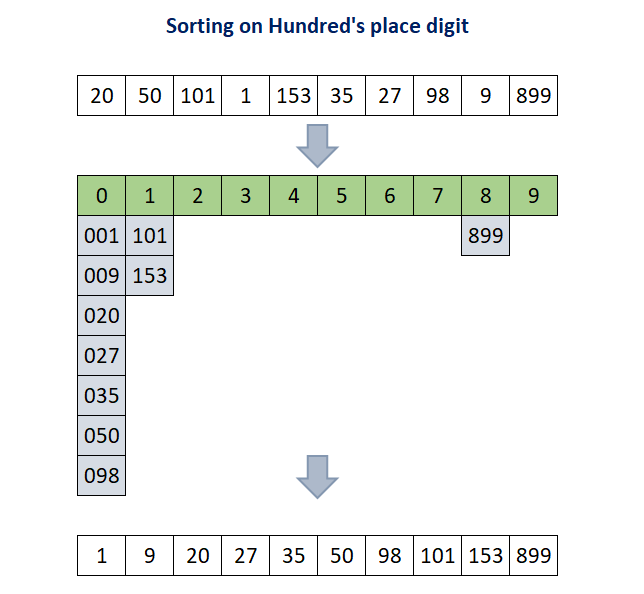

# Radix Sort

<div style="display: grid; grid-template-columns: repeat(auto-fit, minmax(250px, 1fr)); gap: 1rem;">
  
  
</div>

---

### **Initial Array:**

`[170, 45, 75, 90, 802, 24, 2, 66]`

---

### **Step 1: Sort by 1s Digit (Least Significant Digit)**

| Digit | Bucket                                     |
| ----- | ------------------------------------------ |
| **0** | 170, 90                                    |
| **2** | 802, <span style="color:#51afef;">2</span> |
| **4** | <span style="color:#51afef;">24</span>     |
| **5** | 45, 75                                     |
| **6** | <span style="color:#51afef;">66</span>     |

➡️ <code>170, 90, 802, 2, 24, 45, 75, 66</code>

---

### **Step 2: Sort by 10s Digit**

| Digit | Bucket                                     |
| ----- | ------------------------------------------ |
| **0** | 802, <span style="color:#51afef;">2</span> |
| **2** | <span style="color:#51afef;">24</span>     |
| **4** | 45                                         |
| **6** | 66                                         |
| **7** | 170, 75                                    |
| **9** | <span style="color:#51afef;">90</span>     |

➡️ <code>802, 2, 24, 45, 66, 170, 75, 90</code>

---

### **Step 3: Sort by 100s Digit (Most Significant Digit)**

| Digit | Bucket                                                    |
| ----- | --------------------------------------------------------- |
| **0** | <span style="color:#51afef;">2</span>, 24, 45, 66, 75, 90 |
| **1** | <span style="color:#51afef;">170</span>                   |
| **8** | <span style="color:#51afef;">802</span>                   |

➡️ <code>2, 24, 45, 66, 75, 90, 170, 802</code>

---

### **Final Sorted Array:**

<code><span style="color:#51afef;">2</span>, <span style="color:#51afef;">24</span>, <span style="color:#51afef;">45</span>, <span style="color:#51afef;">66</span>, <span style="color:#51afef;">75</span>, <span style="color:#51afef;">90</span>, <span style="color:#51afef;">170</span>, <span style="color:#51afef;">802</span></code>

> 🎉 **Radix Sort completed successfully!**

---

## Radix Sort - C++ Implementation

```cpp
#include <iostream>
using namespace std;

// Function to get the maximum value in the array
int getMax(int arr[], int n)
{
    int maxVal = arr[0];
    for (int i = 1; i < n; i++)
        if (arr[i] > maxVal)
            maxVal = arr[i];
    return maxVal;
}

// Function to perform Radix Sort without Counting Sort, using normal arrays for buckets
void radixSort(int arr[], int n)
{
    int maxVal = getMax(arr, n);
    int buckets[10][n];  // Buckets for digits 0-9
    int bucketCount[10] = {0};  // To track how many elements are in each bucket

    for (int exp = 1; maxVal / exp > 0; exp *= 10)
    {
        // Clear previous bucket contents
        for (int i = 0; i < 10; i++)
            bucketCount[i] = 0;

        // Place elements into buckets based on current digit
        for (int i = 0; i < n; i++)
        {
            int digit = (arr[i] / exp) % 10;
            buckets[digit][bucketCount[digit]++] = arr[i];
        }

        // Gather elements back into the original array
        int index = 0;
        for (int i = 0; i < 10; i++)
        {
            for (int j = 0; j < bucketCount[i]; j++)
                arr[index++] = buckets[i][j];
        }
    }
}

void printArray(int arr[], int n)
{
    for (int i = 0; i < n; i++)
        cout << arr[i] << " ";
    cout << endl;
}

int main()
{
-    int arr[] = {170, 45, 75, 90, 802, 24, 2, 66};
    int n = sizeof(arr) / sizeof(arr[0]);

    cout << "Original array: ";
    printArray(arr, n);

    radixSort(arr, n);

    cout << "Sorted array: ";
    printArray(arr, n);

    return 0;
}
```

