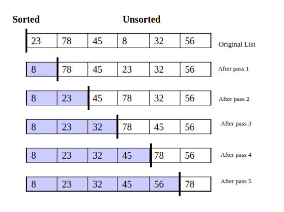
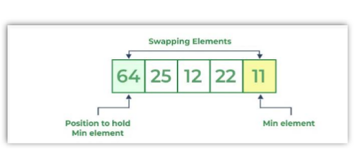

# Selection Sort

<div style="display: grid; grid-template-columns: repeat(auto-fit, minmax(250px, 1fr)); gap: 1rem;">
  
  
</div>

---

### **Initial Array:**

`[20, 12, 10, 15, 2]`

---

### **Pass 1:**

- Find the **smallest element** → `2` (index `4`)
- Swap with the **first element** `20`

➡️ <code><span style="color:#51afef;">2</span>, 12, 10, 15, <span style="color:#51afef;">20</span></code>

---

### **Pass 2:**

- Find the **smallest element** → `10` (index `2`)
- Swap with `12`

➡️ <code>2, <span style="color:#51afef;">10</span>, <span style="color:#51afef;">12</span>, 15, 20</code>

---

### **Pass 3:**

- Element `12` (index `2`) is already in correct place
- **No swap needed**

➡️ <code>2, 10, <span style="color:#51afef;">12</span>, 15, 20</code>

---

### **Pass 4:**

- Element `15` (index `3`) is also in correct place
- **No swap needed**

➡️ <code>2, 10, 12, <span style="color:#51afef;">15</span>, 20</code>

---

### **Final Sorted Array:**

<code><span style="color:#51afef;">2</span>, <span style="color:#51afef;">10</span>, <span style="color:#51afef;">12</span>, <span style="color:#51afef;">15</span>, <span style="color:#51afef;">20</span> </code>

> 🎉 **Selection Sort completed successfully!**

---

## Selection Sort - C++ Implementation

```cpp
#include <iostream>
using namespace std;

void selectionSort(int arr[], int n) {
    for (int i = 0; i < n - 1; i++) {
        int minIndex = i;
        for (int j = i + 1; j < n; j++) {
            if (arr[j] < arr[minIndex]) {
                minIndex = j;
            }
        }
        swap(arr[i], arr[minIndex]);
    }
}

void printArray(int arr[], int n) {
    for (int i = 0; i < n; i++)
        cout << arr[i] << " ";
    cout << endl;
}

int main() {
    int arr[] = {64, 25, 12, 22, 11};
    int n = sizeof(arr) / sizeof(arr[0]);

    cout << "Original array: ";
    printArray(arr, n);

    selectionSort(arr, n);

    cout << "Sorted array: ";
    printArray(arr, n);

    return 0;
}
```
