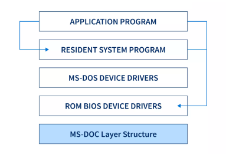
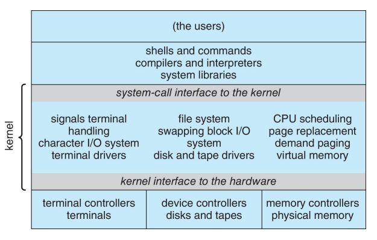
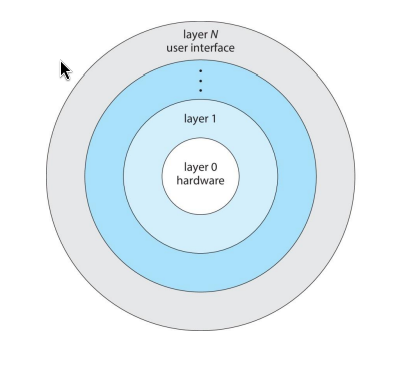
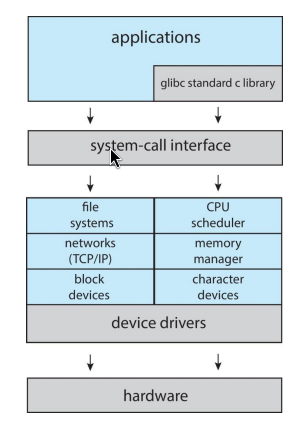
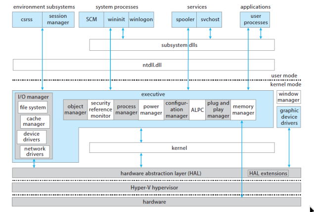

# Operating System Fundamentals

## Overview of OS

<div style="display: grid; grid-template-columns: repeat(auto-fit, minmax(250px, 1fr)); gap: 1rem;">
  
</div>

## 1. What is an Operating System?

```bash

[ hardware ]       → (CPU, memory, devices)
     ⬇
[ **OS** ]         → (kernel, libraries, drivers)
     ⬇
[ applications]    → (word, web browser, etc.)
     ⬇
[ Users ]          → (Persons, Computers, machines)

```

`OS :`
: acts as a **mediator** between hardware and applications.

`Abstraction :`
: to hide details of hardware from applications (e.g., file system, networking,virtual Memory, etc.)

---

### 1.1 OS goals:

- **Simpler:** Hides hardware complexity, making it easier for programmers.
- **Device Independent:** Makes different devices of the same type look the same to apps.
- **Portable:** Provides a consistent interface so apps can run on many machines/versions.

---

### 1.2 How the OS Manages Applications

- **Virtual Machine Interface:**  
  : - Makes each program think it’s the only one running.

- **Protection:**  
  : - Stops one program from interfering with another.

- **Sharing:**  
  : - Lets multiple programs run at the same time and share resources.

---

### 1.3 What is part of an Operating System?

> **Windowing system (GUI)** ?

- Shows windows, icons, mouse, etc.
- Sometimes part of OS (older Windows).
- Sometimes separate (Linux lets you choose).

> **Web browser** ?

- Not part of OS.
- It’s an application running on the OS.

---

### 1.4 Popular Operating Systems Today

| OS             | Description                                                      |
| -------------- | ---------------------------------------------------------------- |
| **Windows 10** | Common on desktops and laptops.                                  |
| **Linux**      | Free, open-source; used on servers, supercomputers, and Android. |
| **FreeBSD**    | Open-source; used for servers and embedded systems.              |
| **Android**    | Most popular mobile OS; based on the Linux kernel.               |
| **macOS**      | Apple’s OS for Mac computers.                                    |
| **iOS**        | Apple’s OS for iPhones and iPads.                                |

---

### 1.5 What Operating Systems Do

- **For Users:** The OS focuses on convenience and ease of use.
- **For Servers:** The OS manages resources to keep many users happy.
- **For Mobile Devices:** The OS must save power and be easy to use.
- **For Embedded Computers:** The OS runs automatically without user input.

---

## 2. Operating System Definition

### 2.1 What is the Kernel,Other Programs,Middleware ?

`kernel :`
: - is the main part of the OS.
: - It always runs and has the `highest privileges`.
: - It connects **software** to **hardware** and manages CPU, memory, etc.

`other programs :`
: - **System programs** – come with OS, help manage things like the GUI, not part of the kernel.
: - **Application programs** – like web browsers or games. They have low privileges and ask the kernel to do tasks (e.g., save files, access network).

`middleware :`
: - Extra software that helps developers, like tools for databases or multimedia.

---

## 3. OS Basics

### 3.1 Primitive OS vs Multitasking

| Topic            | Description                                                                                   | Problems                                                                                                              |
| ---------------- | --------------------------------------------------------------------------------------------- | --------------------------------------------------------------------------------------------------------------------- |
| **Primitive OS** | Just a library of services; can run **one program at a time**; assumes no bad users/programs. | - **Poor hardware use**: CPU idle while disk works.<br>- **Wastes time**: Must wait for one program to finish.        |
| **Multitasking** | Lets **multiple programs** run at once by quickly switching between them (context switch).    | - **Infinite loops**: Program never releases CPU.<br>- **Memory issues**: Program may access/change another’s memory. |

---

### 3.2 How Does the OS Protect Itself and Other Programs?

```bash

User Programs (P1)   →
User Programs (P2)   →   User Space (limited access, safe zone)
User Programs (P3)   →
User Programs (P4)   →

   ⬇ (controlled access)
   ⬇

Kernel (OS Core)  →  Kernel Space (full privileges, direct HW access)

   ⬇
   ⬇
Hardware (CPU, Memory, Devices)
```

- The OS uses **privileged roles** to separate tasks:

  : - **Kernel space** – for the OS core, highest privileges, full access to hardware.
  : - **User space** – for user programs, limited privileges to protect the system.

- This separation stops a faulty or malicious program from:

  : - Crashing the whole system
  : - Affecting other programs

#### 3.2.1 Kernel Space vs User Space Table

| Concept          | Description                                                                | Purpose / Benefit                                          |
| ---------------- | -------------------------------------------------------------------------- | ---------------------------------------------------------- |
| **Kernel Space** | Core of the OS, highest privileges, direct hardware access.                | - Runs critical tasks<br>- Full control over system        |
| **User Space**   | Where user applications (P1–P4) run with limited privileges.               | - Prevents crashes spreading<br>- Protects OS and programs |
| **Separation**   | Clear boundary enforced between kernel and user programs.                  | - Stops faulty/malicious apps from harming system          |
| **Example**      | Programs P1–P4 run safely in user space, kernel stays isolated underneath. | - Stability & security maintained                          |

---

### 3.3 What is a System Call?

- A **system call** is how a program in **user space** asks the **OS kernel** to do something, like access a file or device.
- Think of it as a **special request**—programs can't directly access hardware.
- Unlike normal function calls, system calls **transfer control to the kernel**, which has high privileges.
- The kernel handles the request and then returns control to the program.
- Many common actions (e.g., printing text) use system calls behind the scenes.
  : - Example: `printf()` uses a system call like `write()`.

#### 3.3.1 How Does It Work?

: - The program prepares arguments and uses a special instruction to **trap into the kernel**.
: - This trap switches from **user mode** to **kernel mode**, allowing the OS to complete the request.

```bash

[User Program]
     |
     |  (1) Calls function like printf()
     v
[System Call Interface]
     |
     |  (2) Trap instruction → switch to kernel mode
     v
[OS Kernel]
     |
     |  (3) Kernel exec request (e.g., write to file/device)
     v
[Hardware / Device]
     |
     |  (4) Kernel finishes, switches  to user mode
     v
[User Program continues]
```

---

## 4. Overview of Computer System Structure

### 4.1 How Are the Parts of a Computer Organized?

```bash

                 +----------------------------+
                 |          CPU(s)            |
                 | - Executes instructions    |
                 | - Processes data           |
                 +----------------------------+
                          |
                          v
                 +----------------------------+
                 |          Cache             |
                 | - Small, fast memory       |
                 | - Reduces CPU wait time    |
                 +----------------------------+
                          |
                          v
                 +----------------------------+
                 |       Main Memory          |
                 | - Stores programs & data   |
                 | - Shared by CPU & devices  |
                 +----------------------------+
                          ^
                          |
   -------------------------------------------------------------
   |                         System Bus                        |
   | - Connects CPU, memory, and device controllers           |
   -------------------------------------------------------------
        |                       |                     |
        v                       v                     v
+-------------------+   +-------------------+   +-------------------+
|  Disk Controller  |   | Keyboard Controller|   | Printer Controller|
| - Manages the disk|   | - Handles keyboard |   | - Handles printer |
| - Has local buffer|   | - Has local buffer |   | - Has local buffer|
+-------------------+   +-------------------+   +-------------------+
        |                       |                     |
        v                       v                     v
   +-----------+           +-----------+         +-----------+
   | Disk/SSD  |           | Keyboard  |         | Printer   |
   +-----------+           +-----------+         +-----------+
        ^
        |
   +----------------+
   | DMA Controller |
   | - Moves data   |
   |   without CPU  |
   +----------------+

*Interrupts:* Devices can send signals to CPU via the bus
              to notify events (like I/O completion)

*Timer/Clock:* Generates periodic interrupts for scheduling
               and time management

```

- A computer has:
  : - One or more **CPUs**
  : - **Main memory**
  : - **Device controllers** (for disk, keyboard, printer, etc.)

- All parts connect through the `system bus` (shared communication line).

* `Device controllers` are like managers for specific devices, such as a disk, keyboard, or printer. Each one has its own local buffer to hold data.

- The `CPU` and `I/O devices` can work at the same time, competing for main memory.

---

### 4.2 What is an Interrupt?

<div style="display: grid; grid-template-columns: repeat(auto-fit, minmax(250px, 1fr)); gap: 1rem;">
  
</div>

`Interrupt :`
: - is a signal sent to the **CPU** by a **device controller**.
: - It tells the CPU that an **I/O operation** (like a disk read) is finished.
: - During I/O, the **CPU** and the **device controller** work in parallel.

: > The device controller handles the I/O, moving data to/from its local buffer.
: > Once the I/O operation is done, the controller sends an interrupt signal to the CPU. which says **stop** ,Then CPU can stop what it was doing to handle the request.

### 4.3 What Happens When an Interrupt Occurs?

- Control goes to an **Interrupt Service Routine (ISR)**.
- ISRs are stored in the **interrupt vector**, which tells the OS which routine to run.
- The OS first **saves the CPU state** (registers + program counter) so the program can continue later.
- The OS is **interrupt-driven** – it reacts to events (interrupts) as they happen.

: > The OS doesn't just run in a fixed sequence. Instead, it **waits for events**, like a device finishing a task or a program needing service. When an event (called an **interrupt**) happens, the OS immediately stops what it was doing and handles that event. Afterward, it goes back to what it was doing.

---

### 4.4 What is a Trap?

- A **trap** (or **exception**) is a **software-generated interrupt**.
- It can be caused by:
  : > An error (e.g., divide by zero)
  : > A request (e.g., a **system call**)

---

## 5. I/O Structure

### 5.1 Types of I/O

| Type             | How it Works                             | Pros/Cons                         |
| ---------------- | ---------------------------------------- | --------------------------------- |
| **Synchronous**  | CPU waits until I/O finishes             | Simple but inefficient (CPU idle) |
| **Asynchronous** | CPU starts I/O and continues other tasks | Efficient but more complex        |

## 6. Storage Structure

<div style="display: grid; grid-template-columns: repeat(auto-fit, minmax(250px, 1fr)); gap: 1rem;">
  
</div>

### 6.1 Main Types of Storage

- **Main Memory** – Directly accessed by the CPU.

  > - Usually **volatile** (loses data when power is off).
  > - Example: **`DRAM`**.

- **Secondary Storage** – Large, **non-volatile** storage.

  > - Keeps data even when power is off.
  > - Examples: **`HDD`**, **`SSD`**.

---

### 6.2 Why Storage is a Hierarchy

- Storage is arranged by **speed**, **cost**, and **volatility**.
  > - Top: fast, expensive, small (**`registers`**, **`cache`**).
  > - Bottom: slower, cheaper, larger (**`HDDs  `**, **`magnetic tapes`**).

---

### 6.3 What is Caching?

- **Caching** means copying data from slower storage to faster storage.
- The faster storage is the **cache**.
- When data is needed, the system first checks the cache:
  - **Hit** – data is found in cache (fast).
  - **Miss** – data not in cache, so it’s copied from slower storage.
- The **cache** is smaller than the main storage, so the OS must decide which old data to replace with new data.

### 6.4 What is Cache Coherency?

- In **multitasking** or **multi-CPU** systems, the same data can exist in many places:
  - **Cache**, **main memory**, or **registers**.
- The challenge is keeping all copies **up to date**.
  - If data changes in the cache, other copies might be outdated.
- In **multi-CPU systems**, hardware ensures all CPUs see the latest value.
- In **distributed systems**, the problem is harder since many computers may hold copies.

---

## 7. How Does a Computer Start Up?

<div style="display: grid; grid-template-columns: repeat(auto-fit, minmax(250px, 1fr)); gap: 1rem;">
  
</div>
<br>

> The computer starts up in a specific order:

1. On power-on or reboot, a **bootstrap program** runs.
2. Stored in **firmware** (ROM/EPROM) or in modern PCs in the **SSD**.
3. The bootstrap **initializes the system**.
4. Then it loads the **OS kernel** into `memory` and starts it.

#### How Does the OS Work After Start?

- The **kernel** starts system services called **daemons** or **services** in `Windows`.
- The OS becomes **interrupt-driven**:
  > - Handles **hardware interrupts** (e.g., file ready).
  > - Handles **software interrupts** (e.g., program error).

---

### 7.1 What is Direct Memory Access (DMA)?

- **DMA** is used by fast I/O devices to move data quickly.
- The **device controller** transfers data blocks directly between **main memory** and the device.
- The **CPU** is only interrupted once per **block**, not for every **byte**.
- This makes the system more **efficient**, since the CPU can do other work.

> **Example**: Copying a file from disk to `RAM` with **`DMA`**

1. The **CPU** tells the **DMA controller**:

   - where the data should go in **main memory**
   - how much data to transfer
   - which device (e.g., disk).

2. The **DMA controller** takes over and moves the data **directly from the disk to RAM**, without bothering the CPU for each byte.

3. When the transfer is complete, the **DMA controller** sends one **interrupt** to the CPU to say:
   - "The whole block is done."

: `Result`: The **CPU** is free to run other programs while the transfer happens.

---

### 7.2 Data Structures Used by the Kernel

| Data Structure          | Description                                                  | Example / Note                                  |
| ----------------------- | ------------------------------------------------------------ | ----------------------------------------------- |
| **Linked Lists**        | Items connected in a chain                                   | Can be **singly**, **doubly**, or **circular**  |
| **Binary Search Trees** | Fast way to find data                                        | Like "20 questions" – each step narrows choices |
| **Hash Maps**           | Store data with a **key** for quick lookup                   | Like a phone book                               |
| **Bitmaps**             | Series of **1s and 0s** showing if something is used or free | "1" = used, "0" = free                          |

---

## 8. Operating System Operations

<div style="display: grid; grid-template-columns: repeat(auto-fit, minmax(250px, 1fr)); gap: 1rem;">
  
</div>
### What is Dual-mode Operation?

**Dual-mode operation** helps the OS protect itself and other system parts by having two modes: **user mode** and **kernel mode**.

- **User mode:**

  : - Where user programs run.
  : - Limited privileges, cannot access hardware directly.
  : - Like a **passenger** in a car (can use radio or window buttons).

- **Kernel mode:**

: - Where the OS core runs.
: - Full privileges, can access all hardware.
: - Like the **driver** of the car (controls steering and engine).

- A **mode bit** shows which mode the system is in.
- To do something needing kernel privileges (like accessing a file), a program uses a **system call**.
- **Privileged instructions** can only run in kernel mode to prevent user programs from misusing hardware.

#### How do we guarantee that user does not explicitly set the mode bit to “kernel”?

: - System call changes mode to kernel, return from call resets it to user

```bash
user mode → system call → kernel mode → return → user mode

```

---

### 8.1 Resource Management by the OS

| Resource Area               | What It Does                                                                              |
| --------------------------- | ----------------------------------------------------------------------------------------- |
| **Process Management**      | Creates/deletes **processes**, handles **synchronization** and communication between them |
| **Memory Management**       | Tracks **main memory** usage, allocates/deallocates memory, moves programs in/out         |
| **File-System Management**  | Manages files/directories, access control, maps files to **secondary storage**            |
| **Mass-Storage Management** | Handles large storage devices (**disks**), manages free space, schedules disk access      |
| **I/O Subsystem**           | Hides hardware details, handles **buffering**, **caching**, and **spooling**              |

---

## 9. Main Types of OS Structures

=== "MS-DOS"

    

=== "UNIX"

    

=== "Layered Approach"

    

=== "Micro"

    

| Structure Type            | Description                                                                                                                            | Example        |
| ------------------------- | -------------------------------------------------------------------------------------------------------------------------------------- | -------------- |
| **Simple Structure**      | OS has little structure; all functions in one place; hard to manage or extend                                                          | MS-DOS         |
| **Monolithic Structure**  | Large kernel containing all OS functions (file system, CPU scheduling, memory management)                                              | Original UNIX  |
| **Microkernel Structure** | Non-essential parts moved to **user space**; kernel communicates via **message passing**; more reliable and secure but can be slower   | Mach           |
| **Hybrid Systems**        | Combines approaches; e.g., Linux has a monolithic core plus loadable modules, Windows is mostly monolithic with some microkernel ideas | Linux, Windows |
| **Layered Approach**      | OS divided into **layers**; each layer uses services of the layer below; hardware is at the bottom                                     | –              |

#### Hybrid Systems

=== "Linux"

    

=== "Windows"

    

=== "Mac"

    

=== "Android"

    

| OS / Platform           | Structure Type                           | Notes / Features                                                                                                                                                                                                                                                 |
| ----------------------- | ---------------------------------------- | ---------------------------------------------------------------------------------------------------------------------------------------------------------------------------------------------------------------------------------------------------------------- |
| **Linux & Solaris**     | Monolithic + Modular                     | - Kernel runs in **kernel address space**.<br>- Uses **loadable kernel modules (LKMs)**, so new functionality can be added without rebooting.<br>- Example: plugging in a USB device triggers the kernel to load the required driver.                            |
| **Windows**             | Mostly Monolithic with Microkernel ideas | - Has a central **Executive layer** in the kernel.<br>- Separate **user-mode subsystems** provide different interfaces.<br>- Combines speed of monolithic design with some microkernel features for modularity and security.                                     |
| **Apple (macOS & iOS)** | Hybrid + Layered                         | - Kernel environment is **Darwin**, a hybrid of **Mach microkernel** and **BSD Unix**.<br>- Supports **kernel extensions** for adding modules dynamically.<br>- Uses layers for user experience, application frameworks, and core OS services.                   |
| **Android**             | Modified Linux Kernel                    | - Built on a **Linux kernel** modified for mobile devices.<br>- Handles process, memory, device drivers, and power management.<br>- Uses the **ART virtual machine** for running Java-based apps.<br>- Core libraries provide Android-specific services to apps. |

## 10. Computer System Environments

### 10.1 Types of Operating Systems

| OS Type                        | Description                                                                                                                                                     | Examples / Notes                     |
| ------------------------------ | --------------------------------------------------------------------------------------------------------------------------------------------------------------- | ------------------------------------ |
| **Traditional**                | Stand-alone, general-purpose computers. Less common today as most systems connect to the internet                                                               | Desktop PCs                          |
| **Virtualization**             | Allows one OS to run applications or other OSes inside it. Uses a **Virtual Machine Manager (VMM)**                                                             | Running Windows on Mac, data centers |
| **Mobile**                     | For smartphones/tablets. Optimized for limited resources, battery life, and usability. Supports extra features like GPS and gyroscope                           | Android, iOS                         |
| **Client-Server**              | Many **clients** request services from a central **server**. The server provides resources like files or databases                                              | Company networks, web servers        |
| **Peer-to-Peer (P2P)**         | Distributed system with no fixed client/server roles. All computers are **peers**                                                                               | File-sharing networks, Skype         |
| **Cloud Computing**            | Services (compute, storage) delivered over a network. Uses virtual machines. Types: **public cloud**, **private cloud**; Services: **SaaS**, **PaaS**, **IaaS** | AWS, Google Cloud                    |
| **Real-time Embedded Systems** | Special-purpose computers with strict time constraints; tasks must complete on time                                                                             | Car controllers, industrial machines |
